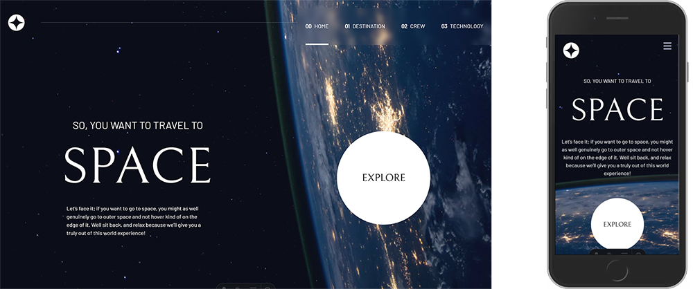

# Space Tourism 🚀

## About

This project offers an interactive interface that showcases the destinations of our solar system, the crew members, and the technologies used to provide a simulation of futuristic space travel.  
Built with Astro and Tailwind CSS, the project features a fully responsive layout to ensure an optimal experience across all devices.

## User Interface Overview

## Objectives

- [x] View each page and toggle between tabs to display different content
- [x] See hover states for all interactive elements on the page
- [x] Experience a responsive design adapted to all screen sizes

## Tech Stack

## About The Author

- [LinkedIn](https://www.linkedin.com/in/jodieaddis/)
- [Portfolio](https://www.linkedin.com/in/jodieaddis/)
